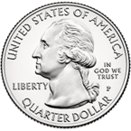
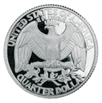

Week 1
So far I have finished most of the code that I need to get the coin to animate, but I need to change the photos to these ones from Flickr and have the right attribution.
https://www.flickr.com/photos/matthiasxc/3600939738/in/photolist-6ucL5U-mYxuYX-e59anV-6ucKVU-pYW1bD-ykE4u4-fKu9Bd-pWQsHb-54x8y-cdXe9d-jbrgnn-jbs98w-dNh1jx-pyYHAZ-34qbZY-5gFzFf-BXqVx3-dYPtHk-7f6CUs-52NCD9-7f6CQq-7f6Czb-pgZVPS-7f6CSw-BXqHiy-fvg1JE-s6JCG5-22fb7Z-7f6CYN-rNVEx-31p3XE-ou2BzV-4Zv53d-CQrRn-7KJ28H-6ewKUG-5gBdnH-3nwvsM-qnxG7Z-ekCmgM-hZkHLG-7f2Kzc-3LbDB-5TDb2s-e1ta4d-ughnx-obn2Yq-3LbDz-5fKJke-qZRKe/

The same user has the heads and tails that I need to use, I will just need to refresh on how to link that pages to my html page.

I was happy with my if/else statements, but still need to continue to add so that it will look better and be more interactive for the user.

I need to work on writing more easy to understand instructions and making it look better.

Week 2
This week I fixed my folders so that the index.html and the README.md aren't under any folders besides the final-project one.

I worked on changing the format within jsfiddle so that I wouldn't need to include the $(document).ready(function() { } at the top of my script.js page

I have found photos that are in the public domain so now I don't have to put specific attribution, but I do need to make the changes that you suggested during my presentation on Tuesday.

I will continue to work on CSS so that it looks more game like and like you suggested I will wait to put on the bootstraps till the last week since I already know how to do those.

Week 3
I changed the source of the images so that they were inside a photos folder and then saved under that folder.

function coinToss() {

  var x = Math.floor(Math.random() * 2);

  if (x === 0) {
    coin.innerHTML = '';

    heads += 1;
    result.innerHTML = 'You got heads';
    headsCounter.innerHTML = '<h1> Number of heads: ' + heads + '</h1>';

  } else {
    coin.innerHTML = '';
     tails += 1;
    result.innerHTML = 'You got tails';
     tailsCounter.innerHTML = '<h1> Number of tails: ' + tails + '</h1>';

  }

}
button.onclick = function() {
  coinToss();
}

var coinToss = Math.random();
if (userChoice === "HEADS") {
    if (coinToss < 0.5) {
        var result = alert("The coin landed on heads. You Win!");
    }
    else {
        var result = alert("The coin landed on tails. You Lose!");
    }
}
else {
    if (coinToss < 0.5) {
        var result = alert("The coin landed on heads. You Lose!");
    }
    else {
        var result = alert("The coin landed on tails. You Win!");
    }
}
